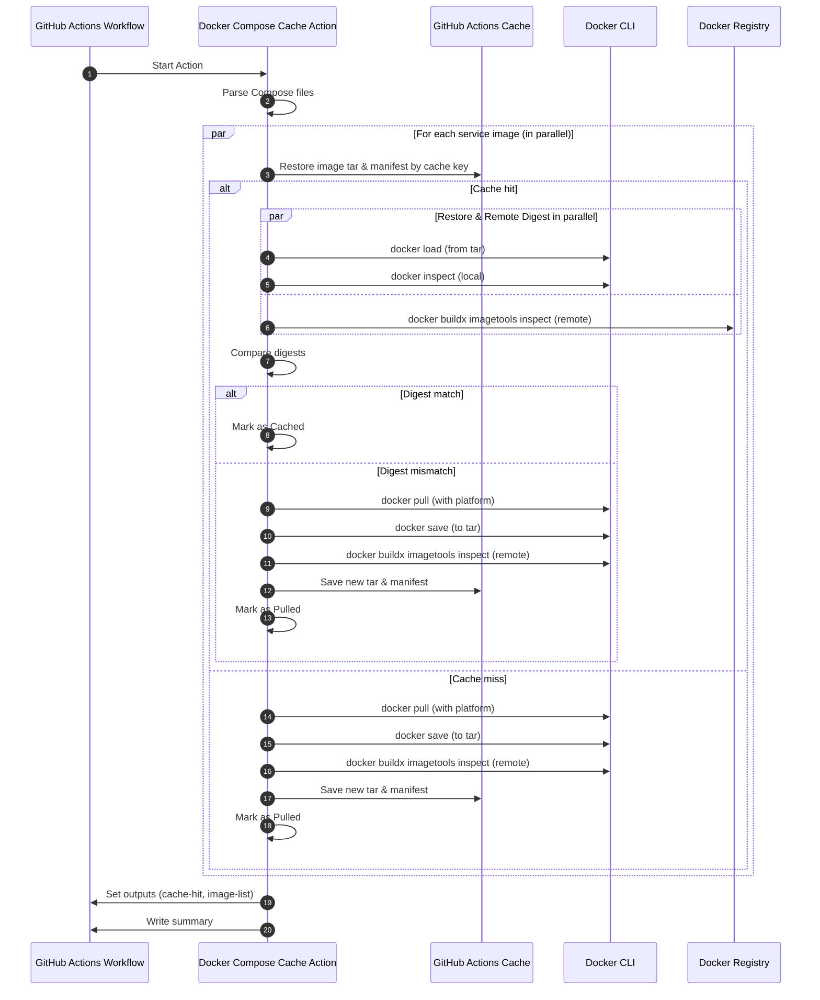

# Docker Compose Cache Action

[](https://github.com/seijikohara/docker-compose-cache-action/releases)
[](https://github.com/seijikohara/docker-compose-cache-action/actions)
[](LICENSE)

A GitHub Action that caches Docker images specified in Docker Compose files to reduce workflow execution time. This action parses your Compose files, intelligently caches images using digests for verification, and only pulls images when necessary.

## Overview

Pulling Docker images can significantly slow down CI/CD workflows in GitHub Actions. While `actions/cache` is effective for many scenarios, caching Docker images from registries presents unique challenges. This action addresses these challenges by:

- **Parsing Docker Compose files** to identify all images used in your services
- **Caching each image as a separate tarball** for better granularity
- **Verifying image freshness via digest checks** to prevent stale cache issues
- **Selective image pulling** based on cache status and digest verification
- **Supporting multiple Compose files** and image exclusion options

### Processing Flow



## Usage

### Quick Start

```yaml
- name: Cache Docker Compose Images
  uses: seijikohara/docker-compose-cache-action@v1
```

### Complete Example

```yaml
name: CI with Docker Compose Cache

on: [push, pull_request]

jobs:
  test:
    runs-on: ubuntu-latest
    steps:
      - name: Checkout code
        uses: actions/checkout@v4

      # Recommended: Login to Docker registries if using private images
      # - name: Log in to Docker Hub
      #   uses: docker/login-action@v3
      #   with:
      #     username: ${{ secrets.DOCKERHUB_USERNAME }}
      #     password: ${{ secrets.DOCKERHUB_TOKEN }}

      - name: Cache Docker Compose Images
        id: cache-docker
        uses: seijikohara/docker-compose-cache-action@v1
        with:
          # Optional: Specify one or more compose files
          compose-files: |
            docker-compose.yml
            docker-compose.prod.yml
          # Optional: Exclude specific images from caching
          exclude-images: |
            nginx:stable
            my-internal-tool:latest
          # Optional: Change the cache key prefix
          cache-key-prefix: my-project-docker-images
          # Optional: Skip checking for latest image versions from registry
          skip-latest-check: false

      - name: Display Cache Info
        run: |
          echo "Cache hit for all images: ${{ steps.cache-docker.outputs.cache-hit }}"

          # Parse the JSON output to display image information
          IMAGE_LIST='${{ steps.cache-docker.outputs.image-list }}'

          if [[ -n "$IMAGE_LIST" ]]; then
            echo "Images processed:"
            echo "$IMAGE_LIST" | jq -r '.[] | "- \(.name) [\(.status)]: \(.size) bytes processed in \(.processingTimeMs)ms"'
          else
            echo "No images processed"
          fi

      - name: Start services with Docker Compose
        run: docker compose -f docker-compose.yml -f docker-compose.prod.yml up -d

      # Your test and build steps go here

      - name: Stop services
        if: always()
        run: docker compose down
```

## How It Works

1. **Discovery**: Parses Compose files to identify all Docker images used by services
2. **Cache Check**: For each image, checks if a valid cached version exists using `actions/cache`
3. **Digest Validation**: Uses `docker buildx imagetools inspect` to compare cached image digest with registry
4. **Smart Pulling**: Only pulls images when necessary (not in cache or digest mismatch)
5. **Caching**: Saves pulled images to the cache using `actions/cache` for future workflows
6. **Detailed JSON Output**: Provides comprehensive information about each image in JSON format, including size, processing time, and cache status
7. **GitHub Actions Summary**: Generates a visual summary table with processing results directly in the GitHub Actions UI

This action also handles platform-specific images automatically. When a platform is specified in the Docker Compose service definition (e.g., `platform: linux/arm64`), it is respected during pulling and caching. For services without an explicit platform, the action uses the runner's architecture.

## Cache Key Structure

Cache keys include the image digest to ensure that updated images create new cache entries. The cache key format is:

```
{prefix}-{imageName}-{tag}-{os}-{arch}-{variant}-{digestPrefix}
```

For example:

```
docker-compose-image-nginx-latest-linux-amd64-none-a1b2c3d4e5f6
```

This design ensures that:

- **Floating tags are handled correctly**: When an image with a tag like `latest` is updated in the registry, a new cache entry is created with the new digest
- **No stale cache issues**: Each unique image version gets its own cache entry
- **Automatic cache rotation**: Old cache entries are naturally evicted by GitHub Actions' cache policies (unused entries expire after 7 days)

### Cache Key Components

| Component      | Description                                 | Example                         |
| -------------- | ------------------------------------------- | ------------------------------- |
| `prefix`       | Custom prefix from `cache-key-prefix` input | `docker-compose-image`          |
| `imageName`    | Docker image name (sanitized)               | `nginx`, `myregistry-com-myapp` |
| `tag`          | Image tag                                   | `latest`, `v1.0.0`              |
| `os`           | Operating system                            | `linux`, `windows`              |
| `arch`         | Architecture                                | `amd64`, `arm64`                |
| `variant`      | Architecture variant (if applicable)        | `v7`, `v8`, `none`              |
| `digestPrefix` | First 12 characters of image digest         | `a1b2c3d4e5f6`                  |

## Skip Latest Check Feature

By default, this action performs digest verification to ensure cached images are up-to-date with the registry. However, you can disable this behavior using the `skip-latest-check` option:

```yaml
- name: Cache Docker Compose Images (Skip Latest Check)
  uses: seijikohara/docker-compose-cache-action@v1
  with:
    skip-latest-check: true
```

### When to Use Skip Latest Check

**Enable `skip-latest-check: true` when:**

- You want faster workflow execution by avoiding registry calls
- Working with specific image versions that don't change (e.g., `mysql:8.0.32` instead of `mysql:8.0`)
- Registry connectivity is limited or slow
- You need consistent image versions across workflow runs
- Working in air-gapped environments

**Keep `skip-latest-check: false` (default) when:**

- You use floating tags like `latest`, `stable`, or `main`
- You want to ensure you have the most recent security updates
- Your images are frequently updated in the registry
- Cache freshness is more important than speed

### Behavior Differences

| Setting                              | Behavior                                                                                                     |
| ------------------------------------ | ------------------------------------------------------------------------------------------------------------ |
| `skip-latest-check: false` (default) | Compares cached image digest with registry. Pulls fresh image if digests don't match.                        |
| `skip-latest-check: true`            | Uses cached images directly without registry verification. Significantly faster but may use outdated images. |

## Configuration

### Inputs

| Input               | Description                                                                                                                                                      | Required | Default                                                                             |
| ------------------- | ---------------------------------------------------------------------------------------------------------------------------------------------------------------- | -------- | ----------------------------------------------------------------------------------- |
| `compose-files`     | Path(s) to Docker Compose file(s). Provide multiple files as multiline string with pipe character.                                                               | `false`  | Searches `compose.yaml`, `compose.yml`, `docker-compose.yaml`, `docker-compose.yml` |
| `exclude-images`    | Images to exclude from caching. Provide multiple images as multiline string with pipe character.                                                                 | `false`  | (empty list)                                                                        |
| `cache-key-prefix`  | Prefix for the generated cache key for each image. Change to invalidate existing caches.                                                                         | `false`  | `docker-compose-image`                                                              |
| `skip-latest-check` | Skip checking the latest version of Docker images from the registry. When enabled, cached images will be used without verifying if newer versions are available. | `false`  | `false`                                                                             |

### Outputs

| Output       | Description                                                                                                                                                                                                                                                                                                                                                                                                                         | Example Value                                       |
| ------------ | ----------------------------------------------------------------------------------------------------------------------------------------------------------------------------------------------------------------------------------------------------------------------------------------------------------------------------------------------------------------------------------------------------------------------------------- | --------------------------------------------------- |
| `cache-hit`  | Boolean value (`'true'` or `'false'`) indicating if all images were restored from cache.                                                                                                                                                                                                                                                                                                                                            | `'true'`                                            |
| `image-list` | JSON array of image details with information about each image. Each image object contains: <br>- `name`: Image name with tag<br>- `platform`: Platform the image was pulled for<br>- `status`: Either 'Cached', 'Pulled', or 'Error'<br>- `size`: Size in bytes (numeric)<br>- `digest`: Image digest string (may be empty if unavailable)<br>- `processingTimeMs`: Processing time in milliseconds<br>- `cacheKey`: Used cache key | See [image-list example](#image-list-example) below |

#### image-list Example

```json
[
  {
    "name": "mysql:8.0",
    "platform": "linux/amd64",
    "status": "Cached",
    "size": 524288000,
    "digest": "sha256:abc123def456...",
    "processingTimeMs": 1200.5,
    "cacheKey": "docker-compose-image-mysql-8.0-linux-amd64-none-abc123def456"
  },
  {
    "name": "redis:alpine",
    "platform": "linux/amd64",
    "status": "Pulled",
    "size": 32768000,
    "digest": "sha256:def456789abc...",
    "processingTimeMs": 3500.2,
    "cacheKey": "docker-compose-image-redis-alpine-linux-amd64-none-def456789abc"
  },
  {
    "name": "node:18",
    "platform": "linux/amd64",
    "status": "Cached",
    "size": 128456789,
    "digest": "sha256:789abcdef012...",
    "processingTimeMs": 950.8,
    "cacheKey": "docker-compose-image-node-18-linux-amd64-none-789abcdef012"
  }
]
```

## Private Registry Authentication

This action works best with public Docker images. For private registries, add authentication steps before this action:

```yaml
steps:
  - uses: actions/checkout@v4
  - name: Log in to GitHub Container Registry
    uses: docker/login-action@v3
    with:
      registry: ghcr.io
      username: ${{ github.actor }}
      password: ${{ secrets.GITHUB_TOKEN }}
  - name: Cache Docker Compose Images
    uses: seijikohara/docker-compose-cache-action@v1
```

## Platform-specific Caching

This action fully supports platform-specific Docker images, which is particularly useful for multi-architecture environments:

1. **Explicit platform definition**: When a `platform` is specified in your compose file, the action honors it:

   ```yaml
   services:
     myservice:
       image: myimage:latest
       platform: linux/arm64
   ```

2. **Automatic platform detection**: When no platform is specified, the action uses the runner's platform.

3. **Cache isolation by platform**: Images are cached separately for each platform, ensuring correct architecture-specific images are stored and retrieved.

4. **Multi-architecture workflow support**: You can use the same compose files across different runner architectures without issues.

## Limitations

- Works optimally with public Docker images
- Private registries require authentication configured before invoking the action
- Images built in the workflow (not pulled from a registry) won't have registry digests to verify against

### GitHub Actions Cache Considerations

1. **Cache Size Limit**: GitHub Actions provides up to 10 GB of cache storage per repository. Large Docker images may consume significant space.

2. **Cache Eviction**: Cache entries not accessed for 7 days are automatically deleted. Older entries are evicted first when approaching the storage limit.

3. **Cross-Platform Caching**: When caching ARM images on x86 runners (or vice versa), the images are cached correctly but cannot run without QEMU emulation. Use [docker/setup-qemu-action](https://github.com/docker/setup-qemu-action) if you need to run cross-platform containers.

## Contributing

Contributions are welcome! Please feel free to submit a Pull Request.

## License

This project is licensed under the [MIT License](LICENSE).
